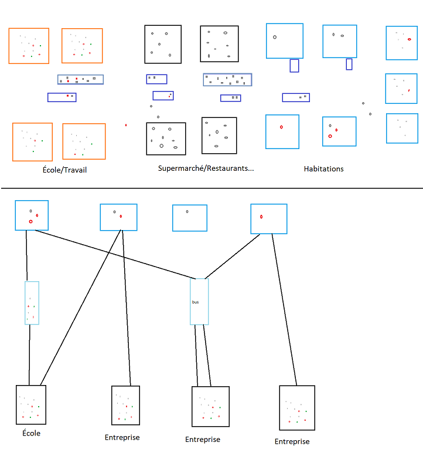
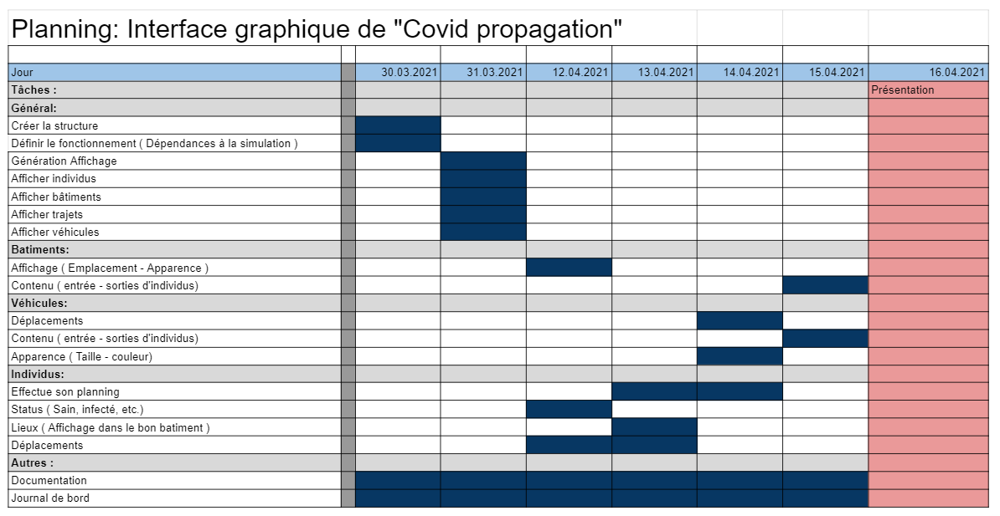

# 1. `Table des matières`
- [1. `Table des matières`](#1-table-des-matières)
- [2. `Introduction`](#2-introduction)
- [3. `Cahier des charges`](#3-cahier-des-charges)
  - [3.1. `Titre`](#31-titre)
  - [3.2. `Fonctionnalités`](#32-fonctionnalités)
    - [3.2.1. `Améliorations`](#321-améliorations)
  - [3.3. `Matériel et logiciels`](#33-matériel-et-logiciels)
  - [3.4. `Prérequis`](#34-prérequis)
  - [3.5. `Descriptif du projet`](#35-descriptif-du-projet)
- [4. `Environnement`](#4-environnement)
- [5. `Architecture`](#5-architecture)
  - [5.1. `Arborescence`](#51-arborescence)
  - [5.2. `Code`](#52-code)
    - [5.2.1. `Méthodes`](#521-méthodes)
    - [5.2.2. `Structure`](#522-structure)
    - [5.2.3. `Implémentation dans le travail de diplôme`](#523-implémentation-dans-le-travail-de-diplôme)
- [6. `Planning`](#6-planning)
  - [6.1. `Prévisionnel`](#61-prévisionnel)
  - [6.2. `Effectif`](#62-effectif)
- [7. `Conclusion`](#7-conclusion)
- [8. `Bibliographie`](#8-bibliographie)
- [9. 4 `Table des figures`](#9-4-table-des-figures)
- [10. `Livrables`](#10-livrables)
# 2. `Introduction`
Ce projet de stage consiste à la réalisation de l'interface graphique du travail de diplôme "Covid propagation". Il s'agit donc de la partie graphique qui permet la visualisation des individus, leurs déplacements, leur lieux de travail, etc. Elle permet d'aquérir une vision plus "logique" de la simulation en dehors des graphiques. Les individus saint, infecté et immunisé sont différencié par leurs couleurs. La même technique est utilisée pour différencier les différents batiments et véhicules mais avec d'autres code couleurs. Les véhicules sont aussi différencié par leur taille en plus de leur couleur.

Ce travail est très important pour le travail de diplôme car il en fait parti mais surtout car il permet de facilement se rendre compte si la simulation se déroule correctement ou si il y a un ou plusieurs bug. Il permet donc d'améliorer mon rendement et de rendre le développement plus rapide et efficace.

Pour réaliser se travail, il faudra que je simule une simulation. Pour fonctionner, l'interface à besoin de données mais ces données n'étant pas encore créées, je vais devoir en générés des fausses.
# 3. `Cahier des charges`
## 3.1. `Titre`
Covid propagation
## 3.2. `Fonctionnalités`
- Bâtiments
    - Affichage des individus
    - Type
- Individus
  - Déplacements
    - Maison
    - Lieu de travail
    - Supermarché
    - ...
  - Status
  - Moyen de transport
- Véhicules
  - Affichage des individus
  - Type
  - Déplacements
### 3.2.1. `Améliorations`
- Individus cliquable
  - Mise en évidence de l'individus
  - Affichage de ses informations

## 3.3. `Matériel et logiciels`
- Pc techniciens
- Visual studio 2019
- Une connexion internet
- Github

## 3.4. `Prérequis`
- C#
- Visual studio 2019
- Élement Graphiques c#

## 3.5. `Descriptif du projet`
L'interface graphique affiche les individus ainsi que leur lieur de travail, habitation et déplacements. Elle permet d'avoir une visualisation plus naturelle de la situation. La structure est simple pour éviter des complexification liée aux routes et autres éléments qui ne sont pas important pour ce travail. Il s'agit donc d'une aide visuel de la simulation. Il n'y a donc pas de routes ou autres éléments complexe similaires.
Voici deux exemples d'interface graphique :


# 4. `Environnement`
L'environnement de travail est composé d'un pc technicien, 3 écrans, clavier, souris et d'un ssd amovible avec windows 10 pro version 10.0.19042 Build 19042. Le code est réalisé à l'aide de visual studio 2019 version 16.9.2. La documentation et le logbook sont réalisé à l'aide de visual studio code et des extensions Markdown All in One et Mardown PDF.
# 5. `Architecture`
## 5.1. `Arborescence`
```
├── CovidPropagationGraphicInterface
│   ├── .vs
│   ├── CovidPropagationGraphicInterface
│   └── CovidPropagationGraphicInterface.sln
└── Documentation
    ├── Documentation.md
    ├── LogBook.md
    └── Medias
        ├── ClassDiagram1.png
        ├── ExemplesInterfaceGraphique.png
        ├── PlanningPrevisionnel.png
        ├── StructureProjet.png
        ├── UseCase.png
        └── UseCase2.png
```
## 5.2. `Code`
### 5.2.1. `Méthodes`

### 5.2.2. `Structure`


### 5.2.3. `Implémentation dans le travail de diplôme`
Le résultat de ce travail étant la partie graphique de mon travail de diplôme, j'ai du pensé à une manière simple et efficace de l'implémenté à l'intérieur. J'ai pensé à différentes approches.

La première étant le fait de simplement intégré la simulation à l'interface graphique. Cette approche permettrait de n'avoir qu'un seul objet de chaque type. C'est l'approche la plus simple mais elle me pose problème en tant qu'ergonomie du code ainsi que de la séparation des données de la vue.

En deuxième, j'ai pensé à une interface qui serait controllée par la simulation mais qui ne serait pas directement intégré dans le objets de celle-ci. Il s'agit d'un hybride entre les deux autres méthodes. Je penses cependant, qu'il s'agisse d'une méthode qui ne soit pas viable.

Et pour terminer celle que j'ai choisis, il s'agit de séparer l'interface graphique de la simulation. Pour ce faire, il faut malheureusement une structure similaire à la simulation ce qui peut finir par réduire drastiquement les performances du projet. Cependant, la structure du code n'en sera que plus propre et le fait que les deux soient autonome évitera de les problèmes de modification de la simulation impactant l'interface graphique.

# 6. `Planning`
## 6.1. `Prévisionnel`
J'ai prévu de d'abord commencé par codé la base de chaque objets et donc de les afficher. Une fois qu'ils sont tous affiché, je prévois de commencer à effectuer les déplacement ainsi que le status des individus. Seulement une fois qu'ils sont capables de se déplacer, j'implémenterai les véhicules. Si tout se passe bien, il me restera du temps le dernier jour pour tout peaufiner.

## 6.2. `Effectif`
# 7. `Conclusion`
# 8. `Bibliographie`
# 9. 4 `Table des figures`
- [Maquette du projet](#35-descriptif-du-projet)
- [Structure du code](#522-structure)
- [Planning prévisionnel](#61-Prévisionnel)

# 10. `Livrables`
- Documentation
- Logbook
- Programme C# Interface graphique