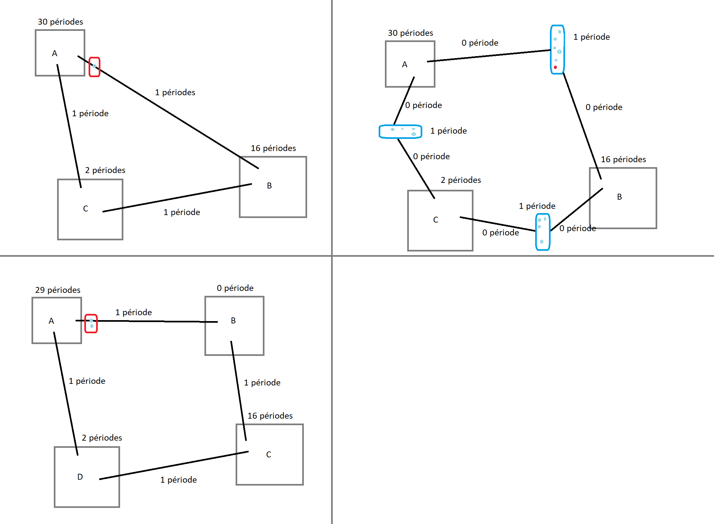
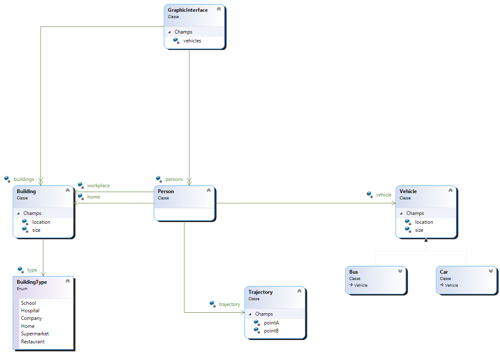
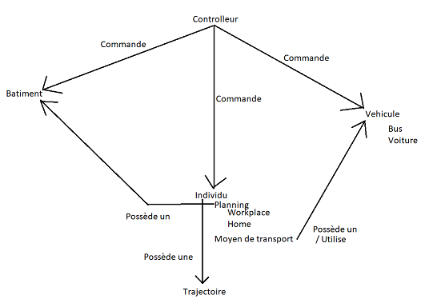
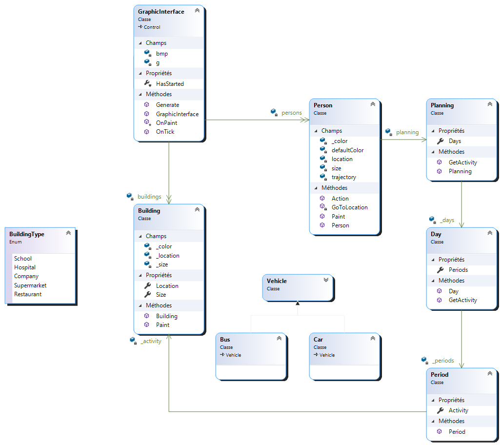
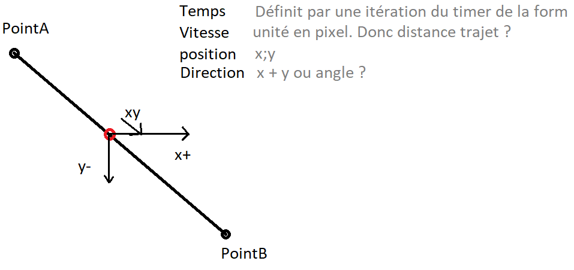
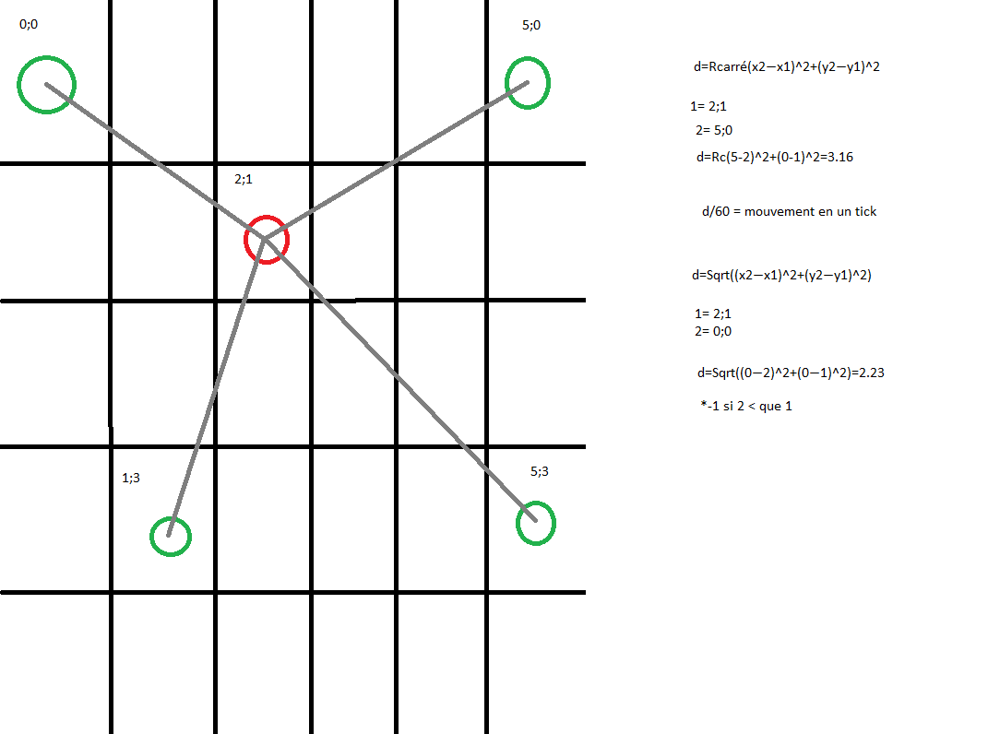
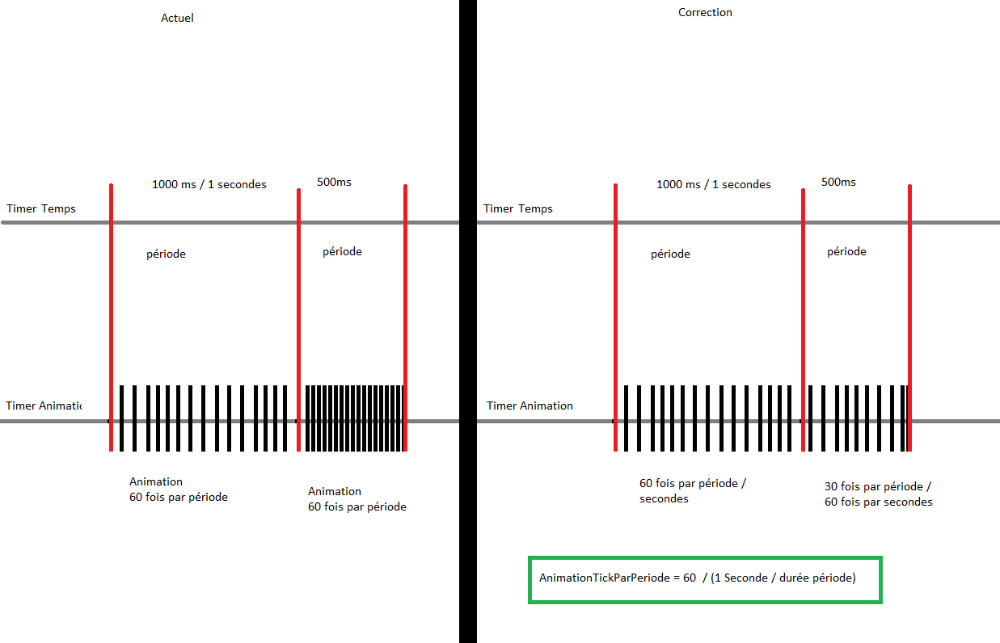
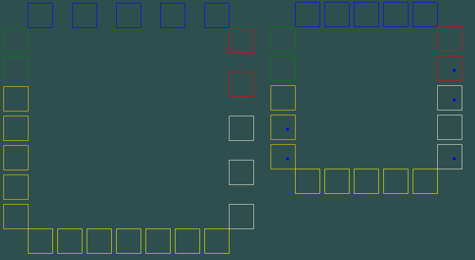
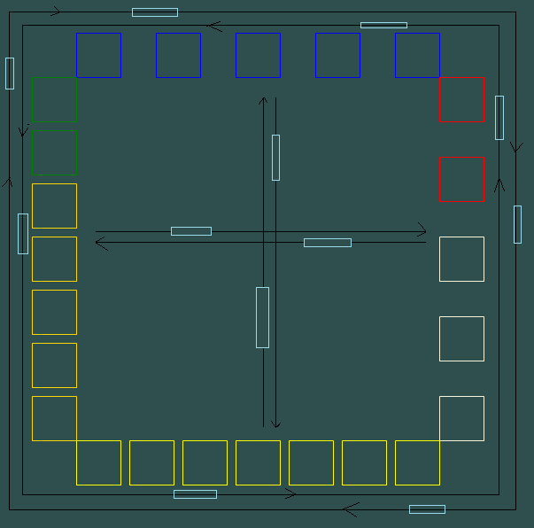

# LogBook
| Auteur | Date de début | Projet  | Description |
| ------------- |:-------------:| :-----|---|
| Joey Martig| 30.03.2021 | Interface graphique de "Covid propagation" | Réalisation de l'interface graphique du travail de diplôme "Covid propagation". L'interface graphique est composée d'éléments graphiques de visual studio et permet de mieux visualiser la situation de la simulation. |
# 30.03.2021
- Plan du projet
- Réflexion composition interface
- Première idée:
  -  Comportant un trajet simple qui sera la première à être implémenté. 
  -  Un autre trajet en bus qui consisterait en la personne allant vers le bus sans compter de période qui se déplacerait pendant la période puis il se déplace vers le sa destination sans compter de période.
  -  Et finalement un trajet comportant une personne qui dépose une autre personne à un endroit. Je vais encore réfléchir à celui-ci.

- Installation du concepteur de classe de visual studio
- Réalisation de la première structure initiale du projet
  - Les bâtiments contrairement à la simulation, ne sont différents que par leur couleur. Leur différence est donc simplement gérée par un enum et non par la création de plusieurs sous-classes.
  - La trajectoire peut être utile pour la visualisation, mais risque de disparaitre de la version finale.
  - Les véhicules ayant plus de différence entre eux (Taille, couleur, quantité de personnes, etc.) que les bâtiments, il y a donc deux sous-classes qui héritent d'un objet voiture. 
- Documentation
  - Début de l'introduction.
    - Description du travail de stage.
    - Avantage pour le travail de diplome et utilité
  - Structure documentation
  - Réalisation du planning
  - Architecture du projet
    - Implémentation dans le travail de diplôme
    - Arborescence
  - Environnement
  - Cahier des charges
- Structure du projet
  - Lien avec la futur simulation
    - ~~2 en 1 ?~~
      - ~~Trop de fonctionnalité dans un seul objet~~
      - ~~Structure plus simple~~
    - Séparé ?
      - Code plus propre
      - Gourmant en ressources
      - Après génération de la simulation. Cloner le contenu ( individus, batiments ) en objets simplifiés et ne contenant que les données nécessaires.
      - Garder le même pointeur sur le planning qui contiendrait les destination de la personne.
    - ~~Séparé mais géré par la simulation ?~~ ou par un autre controlleur spécifique à la vue ?
  - 
- Structure du code
  - Reflexion sur qui fait quoi ainsi que qui possède quoi
  - Impacte sur le travail de diplome (Implémentation)
  - 
- Début du code de l'interface
  - Timer
  - Paint
- Bug git - Visual studio
  - Suppression de la moitié du projet c#
  - Recréation du projet
# 31.03.2021
- Développement documentation
  - Planning
  - Structure
  - Ajoute de figures
- Réflexion sur la structure des jours de la semaine dans le planning
  - Tableau ? --> taille fixe, simple
  - ~~Variables --> 7, propriété ? --> simple d'appel et clair~~
- Création de la classes individus et du planning
  - Nouvelle version de la structure de classe
  - Les véhicules n'étant pas encore implémenté, ils sont relié à aucune autre classe.
  - Le type de batiment est uniquement utilisé pour définir la couleur du batiment à la création.
  - 
- Création d'une classe static de constantes permettant leur appelle dans tout le projet et évitant la redondance.
- Créer une classe similaire pour gérer le temps ? Afin d'éviter de constamment demander l'heure qu'il est à une classe parent. Appeler une classe static gérant le temps (Pas un timer mais un compteur de jours et de périods.)
- Création de la classe static TimeManager
- La classe Planning est commune à la simulation ainsi qu'à l'interface graphique.
- Une activité (qui correspond à une période) doit être avoir un nouveau type d'activité ou simplement utiliser les batiments en tant que valeur ?
- Modification de la classe TimeManager pour afficher le jour et l'heure
- Création d'une classe "Clock" permettant l'affichage graphic du jour et de l'heure de la simulation.
- Création de "faux" batiments destiné à être supprimé pour le travail de diplome
- Création de "faux" individus destiné à être supprimé pour le travail de diplome
- Penser à intégrer une fonctionnalité qui modifie la taille des éléments en fonction de la quantité d'éléments affiché. Permettant donc l'affichage de tous les éléments
- Reflexion sur le fonctionnement du programme.
  - Un timer qui décide et de l'animation ET du temps qui passe n'est pas concevable.
  - Pour palier à ce problème, création d'un timer d'animation dans la class "GraphicInterface" permettant d'avoir 60 images par secondes peut importe l'interval du timer de la fenêtre principale qui s'occupe de faire s'écouler le temps.
- Création des trajectoires
- Aide impression couleur pour Gawen (10 min)
- Création des déplacement des individus
  - Vitesse
  - Direction
  - 
  - Quel timer effectue quelle action ? Le timer d'animation déplace tendit que le timer de la form définit la vitesse ?
  - Oubli ⚠️ le planning doit contenir la durée du trajet. 
    - Modification nécessaire.
    - La période ne peut pas seulement contenir le batiment
    - Utiliser les véhicule comme batiment à la place ?
- Création des véhicules
  - La personne dans le vehicule le suit ~~ou l'inverse ?~~

# 01.04.2021
- Modification du planning pour y intégrer les trajets
  - Création d'une interface "Activity" intégrant une propriété récupérant la position de l'activity ainsi que l'emplacement interne de celui-ci.
- Création de "faux" véhicules destiné à être supprimé pour le travail de diplome
- Modification du fonctionnement d'un individu
    - Changement de quel timer affect quel évènement.
    - Timer principal --> Change l'activité donc la destination
    - Timer d'animation --> Déplace l'individus vers sa destination
- ~~Ajout d'une classe "Walk" Si un individus marche à la place de prendre un véhicule.~~
  - ~~`Penser à changer le nom de la classe parent.`~~
  - ~~Peut être même à supprimer et simplement utiliser la classe person pour le déplacement~~

# 02.04.2021
- Utiliser des points dans les véhicules qu'un individus n'aura qu'à récupérer pour connaitre sa position dans le véhicule.
- Déplacement des individus
  - En fonction du timer d'animation
  - Calcul la distance a parcouris
  - La divise par le nombre de fps
  - Utilise le résultat pour se déplacer à chaque frame
  - 

# 03.04.2021
- Pour le travail de diplôme, ajouter des chauffeurs de bus.
- Bug
  - Les voitures s'arrête au milieux du trajet. (Elles semblent ne pas aller assez vite alors que les données (position, vitesse, destination) sont correctes)
  - Les timers en sont la cause.
    - Le timer d'animation n'a pas le temps d'effectuer ses 60 frames avant que le second timer n'effectue le changement de periods
    - L'interval est en int --> impossible d'aller assez rapidement et précisement
    - Erreur --> actuellement ~~60 fps~~ mais 60 images par periodes
    - 
  - Problèmes de timer et voitures réglé !

# 04.04.2021
- Réglage d'un bug qui permettait aux objets en mouvements de se déplacer plus loins que prévu.
  - Le timer itérait parfois 64 fois par seconde alors que les objets calcuilait leur vitesse pour bouger 60 fois. Ils se déplaçait donc trop loins 4 fois.
- Positionnement des batiments
  - Bug. Les batiments se placenent correctement en théorie mais sont déplacé en 0;0 sans raison connue.
  - Modification du code dans PositioningBuildings()  Foreach + Switch --> Linq
  - Positionnement dynamique en fonction du nombre de batiments de chaque type
  - 
  - Refactorisation

# 12.04.2021
- Oubli de push une partie du travail effectué durant les vacances
  - Futur problèmes de conflits avec git prévu dans le code et logbook
- Implémentation du Status des individus
  - Les pointeurs de variables simple tel que les enums ne pouvant être utilisé uniquement en mode unsafe, création d'un objet simple contenant l'état
  - Le but étant que les personnes de la simulation et de l'interface graphique pointent sur le même état et qu'en cas de modification de la simulation, l'interface change automatiquement.
- Modification de la structure de la classe véhicule pour intégrer les bus
  - Déplacements de méthodes de la classe parent à la classe voiture
- Modification de la trajectoire pour l'afficher uniquement si il y a peu d'individus
- Vehicules
  - Les voitures ne s'affichent qu'en cas de déplacements
  - Reflection sur les bus. L'idée actuelle est bonne mais risque de restraindre la simulation en terme de planning.
    - Essayer de simplifier encore pour n'avoir qu'une seule ligne de bus qui fait le tour des batiments
    - Problème similaire. Si les bus vont trop vite, ce n'est pas lisible. S'ils vont trop lentement, Risque de téléportation et incohérence
    - Idée final permettant le déplacement des individus de manière optimal tout en limitant le traffique au centre.
    - 
    - Ajouter des arrêts de bus ? 1 par ligne/colonne
      - +Permet un affichage plus propre et vivant
      - -Encore plus difficile à mettre en place
- Ajout d'une extension de liste permettant de compter le nombre d'élément dans la liste en partant de 0. ( évitant donc de faire list.Count - 1 )
- Création des bus
  - Première itération.
    - Création des lignes de bus puis positionnement des bus. Une fois lançé, les bus se déplacent en boucle sur leur ligne.
    - Probable futur problème pour cloner les bus de la simulation pour l'interface graphique.
    - Tentative de rotation des bus. Impossible avec C#. La rotation tourne l'entièreté de l'interface.
    - Essai de rotation en interchangeant largeur et hauteur.
    - Les bus en intérieur sont fonctionnel.
      - Pour le moment ils ne prennent pas en compte les individus qui entrent / sortent
    - Ligne des bus exterieure effectué au même niveau que les bus intérieurs