# LogBook
| Auteur | Date de début | Projet  | Description |
| ------------- |:-------------:| :-----|---|
| Joey Martig| 30.03.2021 | Interface graphique de "Covid propagation" | Réalisation de l'interface graphique du travail de diplôme "Covid propagation". L'interface graphique est composée d'éléments graphiques de visual studio et permet de mieux visualiser la situation de la simulation. |
# `30.03.2021`
- Plan du projet
- Réflexion composition interface
- Première idée:
  -  Comportant un trajet simple qui sera la première à être implémenté. 
  -  Un autre trajet en bus qui consisterait en la personne allant vers le bus sans compter de période qui se déplacerait pendant la période puis il se déplace vers le sa destination sans compter de période.
  -  Et finalement un trajet comportant une personne qui dépose une autre personne à un endroit. Je vais encore réfléchir à celui-ci.
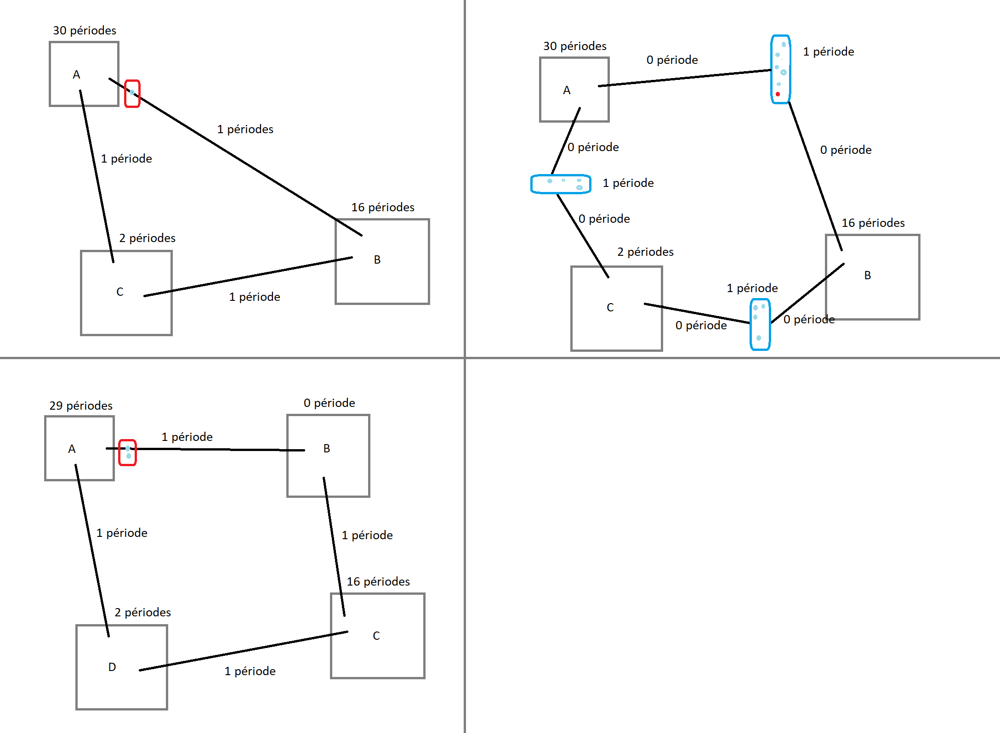
- Installation du concepteur de classe de visual studio
- Réalisation de la première structure initiale du projet
  - Les bâtiments contrairement à la simulation, ne sont différents que par leur couleur. Leur différence est donc simplement gérée par un enum et non par la création de plusieurs sous-classes.
  - La trajectoire peut être utile pour la visualisation, mais risque de disparaitre de la version finale.
  - Les véhicules ayant plus de différence entre eux (Taille, couleur, quantité de personnes, etc.) que les bâtiments, il y a donc deux sous-classes qui héritent d'un objet voiture. 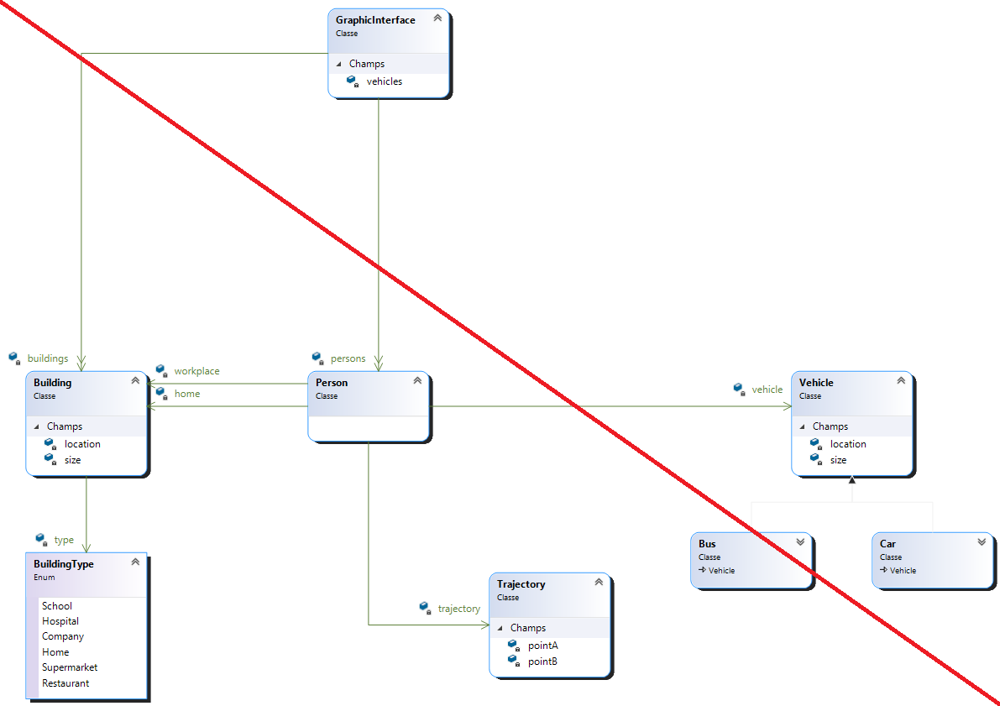
- Documentation
  - Début de l'introduction.
    - Description du travail de stage.
    - Avantage pour le travail de diplôme et utilité
  - Structure documentation
  - Réalisation du planning
  - Architecture du projet
    - Implémentation dans le travail de diplôme
    - Arborescence
  - Environnement
  - Cahier des charges
- Structure du projet
  - Lien avec la future simulation
    - ~~2 en 1 ?~~
      - ~~Trop de fonctionnalité dans un seul objet~~
      - ~~Structure plus simple~~
    - Séparé ?
      - Code plus propre
      - Gourmant en ressources
      - Après génération de la simulation. Cloner le contenu ( individus, bâtiments ) en objets simplifiés et ne contenant que les données nécessaires.
      - Garder le même pointeur sur le planning qui contiendrait les destinations de la personne.
    - ~~Séparé, mais géré par la simulation ?~~ ou par un autre contrôleur spécifique à la vue ?
  - 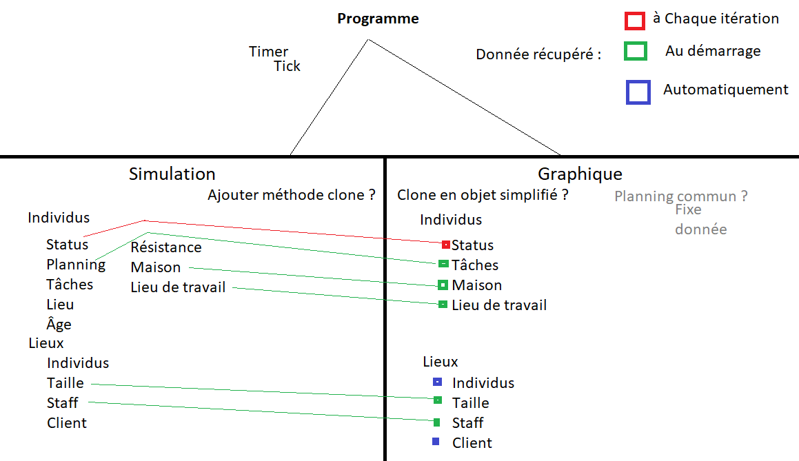
- Structure du code
  - Réflexion sur qui fait quoi ainsi que qui possède quoi
  - Impacte sur le travail de diplôme (Implémentation)
  - 
- Début du code de l'interface
  - Timer
  - Paint
- Bug git - Visual studio
  - Suppression de la moitié du projet c#
  - Recréation du projet
# `31.03.2021`
- Développement documentation
  - Planning
  - Structure
  - Ajoute de figures
- Réflexion sur la structure des jours de la semaine dans le planning
  - Tableau ? --> taille fixe, simple
  - ~~Variables --> 7, propriété ? --> simple d'appel et clair~~
- Création de la classe individus et du planning
  - Nouvelle version de la structure de classe
  - Les véhicules n'étant pas encore implémentés, ils ne sont reliés à aucune autre classe.
  - Le type de bâtiment est uniquement utilisé pour définir la couleur du bâtiment à la création.
  - 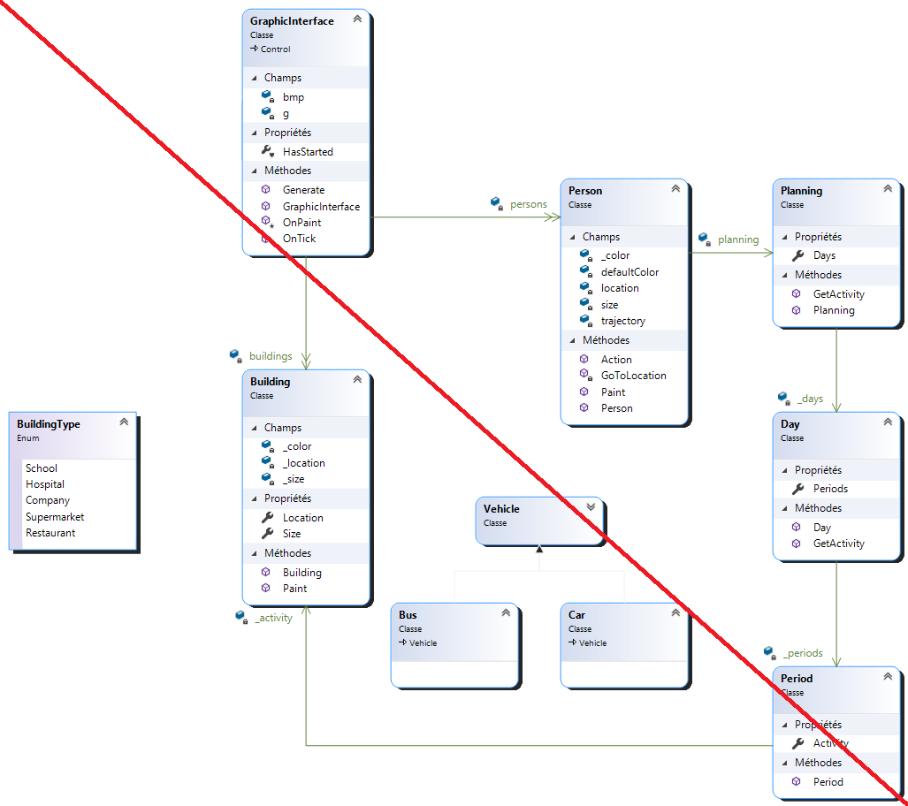
- Création d'une classe static de constantes permettant leur appelle dans tout le projet et évitant la redondance.
- Créer une classe similaire pour gérer le temps ? Afin d'éviter de constamment demander l'heure qu'il est à une classe parent. Appeler une classe static gérant le temps (pas un timer, mais un compteur de jours et de périodes.)
- Création de la classe static TimeManager
- La classe Planning est commune à la simulation ainsi qu'à l'interface graphique.
- Une activité (qui correspond à une période) doit être avoir un nouveau type d'activité ou simplement utiliser les bâtiments en tant que valeur ?
- Modification de la classe TimeManager pour afficher le jour et l'heure
- Création d'une classe "Clock" permettant l'affichage graphique du jour et de l'heure de la simulation.
- Création de "faux" bâtiments destinés à être supprimés pour le travail de diplôme
- Création de "faux" individus destinés à être supprimés pour le travail de diplôme
- Penser à intégrer une fonctionnalité qui modifie la taille des éléments en fonction de la quantité d'éléments affichés. Permettant donc l'affichage de tous les éléments.
- Réflexion sur le fonctionnement du programme.
  - Un timer qui décide et de l'animation ET du temps qui passe n'est pas concevable.
  - Pour palier à ce problème, création d'un timer d'animation dans la class "GraphicInterface" permettant d'avoir 60 images par seconde peut importe l'interval du timer de la fenêtre principale qui s'occupe de faire s'écouler le temps.
- Création des trajectoires
- Aide impression couleur pour Gawen (10 min)
- Création des déplacements des individus
  - Vitesse
  - Direction
  - 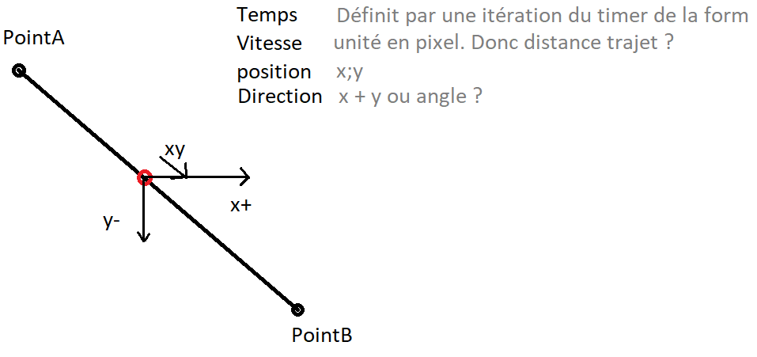
  - Quel timer effectue quelle action ? Le timer d'animation déplace tendit que le timer de la form définit la vitesse ?
  - Oubli ⚠️ le planning doit contenir la durée du trajet. 
    - Modification nécessaire.
    - La période ne peut pas seulement contenir le bâtiment
    - Utiliser les véhicules comme bâtiment à la place ?
- Création des véhicules
  - La personne dans le véhicule le suit ~~ou l'inverse ?~~

# `01.04.2021`
- Modification du planning pour y intégrer les trajets
  - Création d'une interface "Activity" intégrant une propriété récupérant la position de l'activité ainsi que l'emplacement interne de celui-ci.
- Création de "faux" véhicules destinés à être supprimés pour le travail de diplôme
- Modification du fonctionnement d'un individu
    - Changement de quel timer affecte quel évènement.
    - Timer principal --> change l'activité donc la destination
    - Timer d'animation --> Déplace l'individu vers sa destination
- ~~Ajout d'une classe "Walk" si un individu marche à la place de prendre un véhicule.~~
  - ~~`Penser à changer le nom de la classe parent.`~~
  - ~~Peut-être même à supprimer et simplement utiliser la classe person pour le déplacement~~

# `02.04.2021`
- Utiliser des points dans les véhicules qu'un individu n'aura qu'à récupérer pour connaitre sa position dans le véhicule.
- Déplacement des individus
  - En fonction du timer d'animation
  - Calcul la distance a parcourir
  - La divise par le nombre de fps
  - Utilise le résultat pour se déplacer à chaque frame
  - 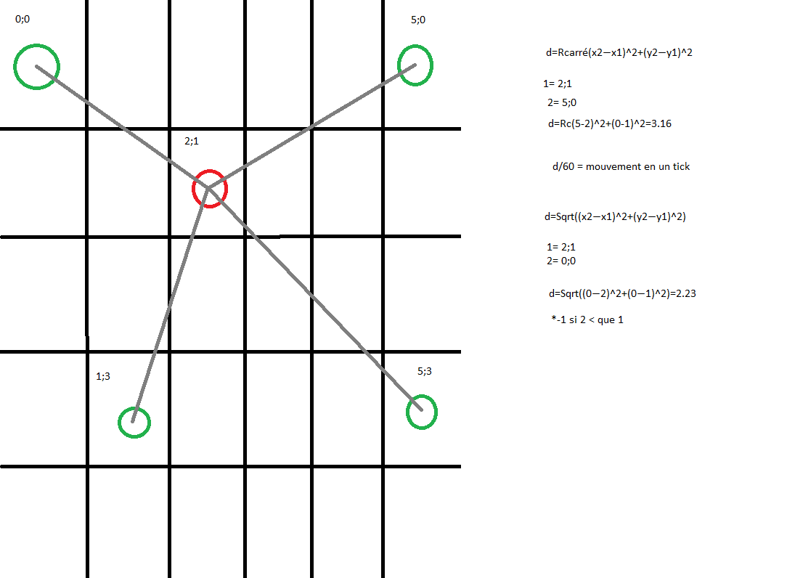

# `03.04.2021`
- Pour le travail de diplôme, ajouter des chauffeurs de bus.
- Bug
  - Les voitures s'arrêtent au milieu du trajet. (Elles semblent ne pas aller assez vite alors que les données (position, vitesse, destination) sont correctes)
  - Les timers en sont la cause.
    - Le timer d'animation n'a pas le temps d'effectuer ses 60 frames avant que le second timer n'effectue le changement de période
    - L'interval est en int --> impossible d'aller assez rapidement et précisément
    - Erreur --> actuellement ~~60 fps~~, mais 60 images par période
    - 
  - Problème de timer et voitures réglé !

# `04.04.2021`
- Réglage d'un bug qui permettait aux objets en mouvements de se déplacer plus loin que prévu.
  - Le timer itérait parfois 64 fois par seconde alors que les objets calculaient leur vitesse pour bouger 60 fois. Ils se déplaçaient donc trop loin 4 fois.
- Positionnement des bâtiments
  - Bug. Les bâtiments se placent correctement en théorie, mais sont déplacés en 0;0 sans raison connue.
  - Modification du code dans PositioningBuildings()  Foreach + Switch --> Linq
  - Positionnement dynamique en fonction du nombre de bâtiments de chaque type
  - 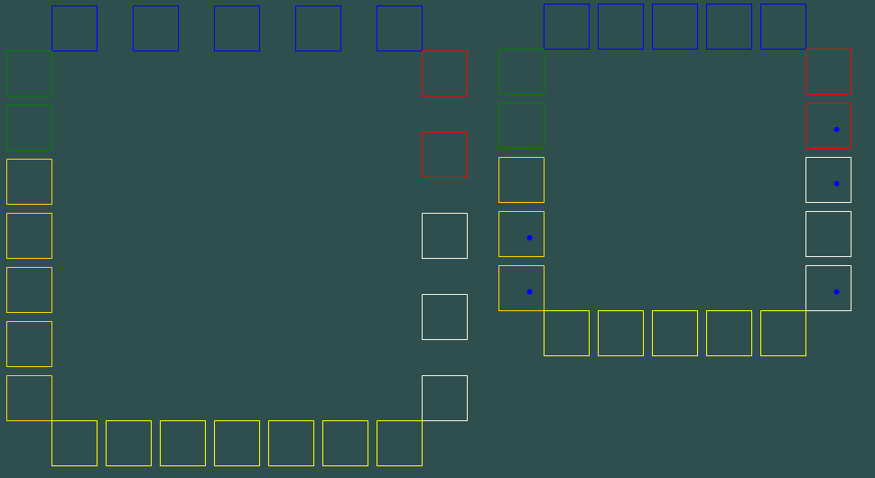
  - Refactorisation

# `05.04.2021`
- Modification du positionnement dynamique pour prendre la taille en compte.
  - 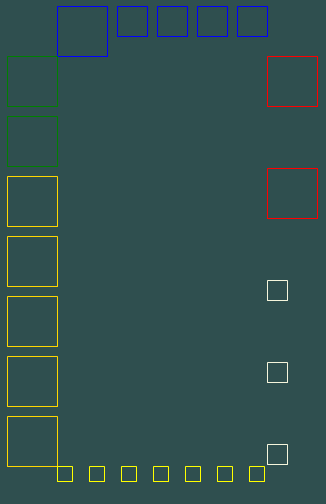
- Création des bus
  - Réflexion sur leur fonctionnement
    - Créer un "arrêt" de bus pour chaque ligne et colonne.
    - Les bus se garent là et se dirigent vers une zone

# `10.04.2021`
- Création des bus
  - Réflexion sur leur fonctionnement
  - Idée 1:
    - Les bus s'arrêtent aux arrêts et repartent selon un horaire fixe.
    - Ils se situent au centre avec le reste du trafic.
    - Le fait qu'ils se situent au centre risque de rendre la simulation illisible par le trop grand nombre de véhicules.
    - 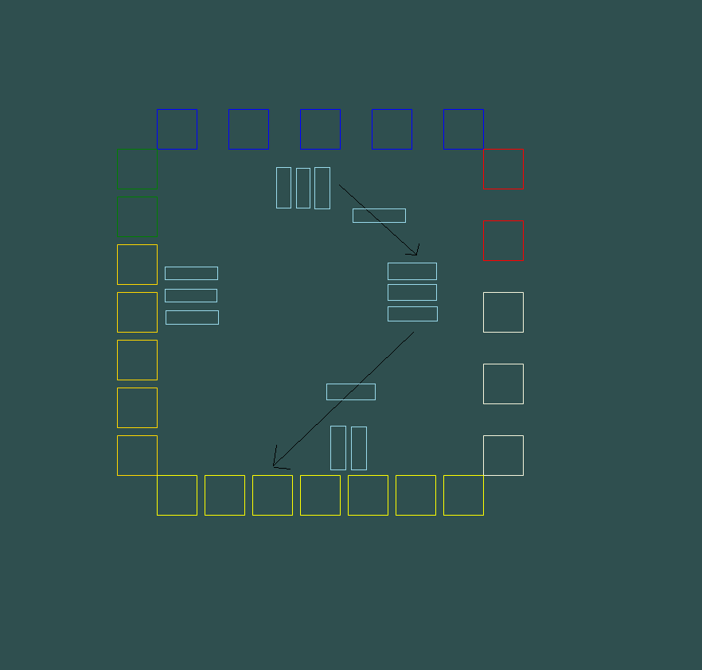
  - Idée 2:
    - Cette structure permet de limiter le nombre d'entités au centre.
    - Cependant la création de celle-ci semble extrêmement compliquée.
    - Il semble aussi compliqué de l'implémenter correctement pour subvenir aux besoins de transports nécessaires au fonctionnement de la simulation
    - 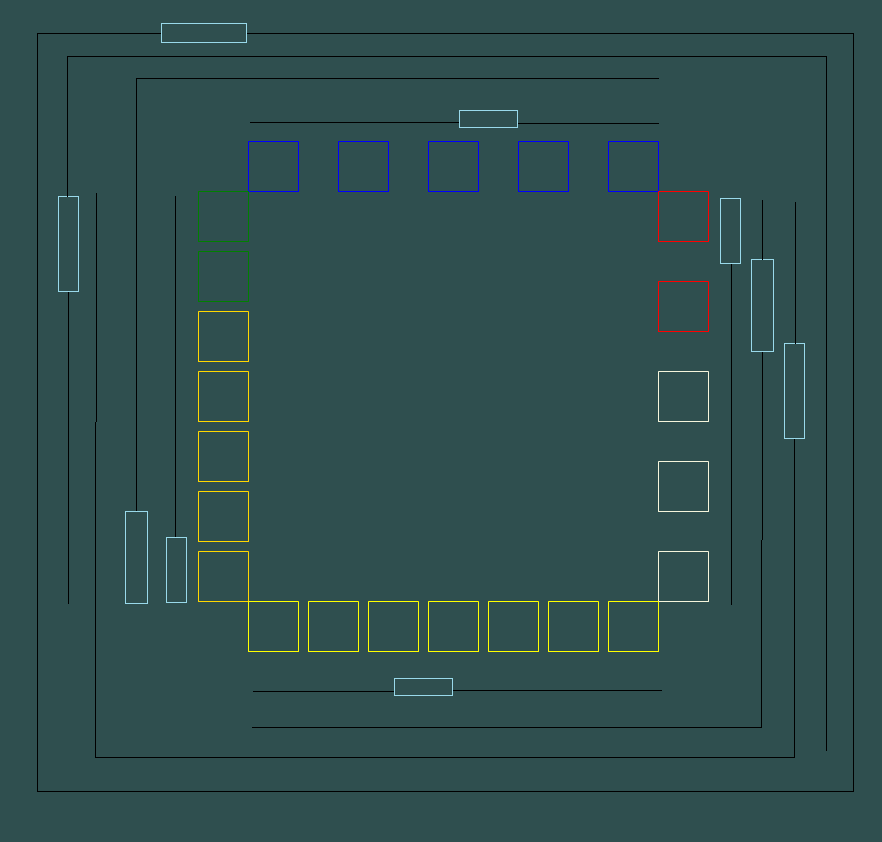
  - Idée 3:
    - Version simplifiée de l'idée 2
    - Plutôt que d'avoir une grande quantité de voie. Simplement avoir une voie pour chaque ligne/Colonne et une voie les reliant toutes.
    - 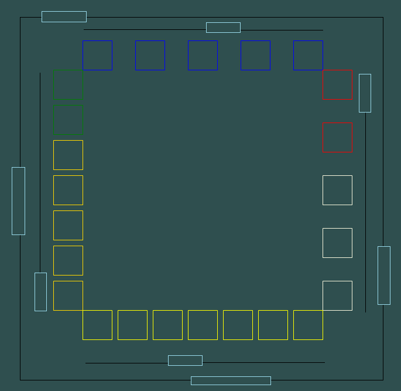
- Ajout d'une légende
  - 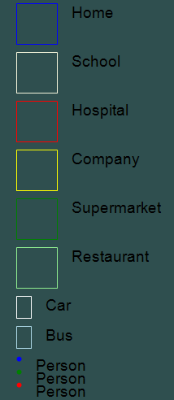
# `12.04.2021`
- Oubli de push une partie du travail effectué durant les vacances
  - Futurs problèmes de conflits avec git prévu dans le code et logbook
- Implémentation du Status des individus
  - Les pointeurs de variables simples tels que les enums ne pouvant être utilisés uniquement en mode unsafe, création d'un objet simple contenant l'état
  - Le but étant que les personnes de la simulation et de l'interface graphique pointent sur le même état et qu'en cas de modification de la simulation, l'interface change automatiquement.
- Modification de la structure de la classe véhicule pour intégrer les bus
  - Déplacements de méthodes de la classe parente à la classe voiture
- Modification de la trajectoire pour l'afficher uniquement s’il y a peu d'individus
- Véhicules
  - Les voitures ne s'affichent qu'en cas de déplacements
  - Reflection sur les bus. L'idée actuelle est bonne, mais risque de restreindre la simulation en termes de planning.
    - Essayer de simplifier encore pour n'avoir qu'une seule ligne de bus qui fait le tour des bâtiments
    - Problème similaire. Si les bus vont trop vite, ce n'est pas lisible. S'ils vont trop lentement, Risque de téléportation et incohérence.
    - Idée finale permettant le déplacement des individus de manière optimal tout en limitant le trafic au centre.
    - 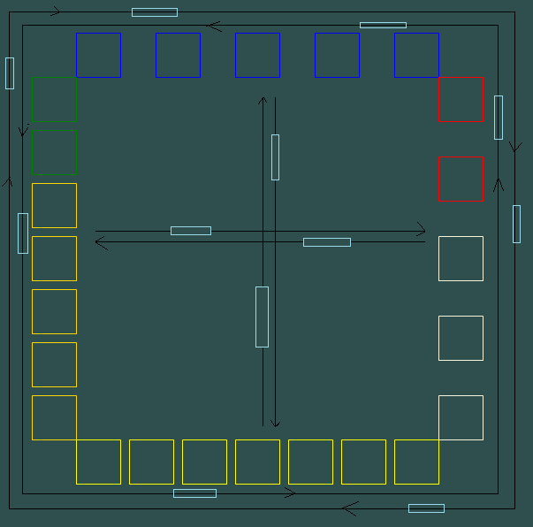
    - Ajouter des arrêts de bus ? 1 par ligne/colonne
      - +Permet un affichage plus propre et vivant
      - -Encore plus difficile à mettre en place
- Ajout d'une extension de liste permettant de compter le nombre d'éléments dans la liste en partant de 0. ( évitant donc de faire list.Count - 1 )
- Création des bus
  - Première itération.
    - Création des lignes de bus puis positionnement des bus. Une fois lancés, les bus se déplacent en boucle sur leur ligne.
    - Probable futur problème pour cloner les bus de la simulation pour l'interface graphique.
    - Tentative de rotation des bus. Impossible avec C#. La rotation tourne l'entièreté de l'interface.
    - Essai de rotation en interchangeant largeur et hauteur.
    - Les bus en intérieur sont fonctionnels.
      - Pour le moment ils ne prennent pas en compte les individus qui entrent / sortent
    - Ligne des bus extérieurs effectués au même niveau que les bus intérieurs
  - Possible problème au niveau de l'entrée des personnes dans les bus
    - Solutions :
      - ~~Revoir la structure~~
      - ~~Allonger les trajets en bus pour qu'ils durent 2 périodes~~
      - Créer un système d'arrêt de bus qui ne dépend pas des périodes
        - Reprend la logique du planning --> jour --> période, mais en simplifié
- Discussion du sujet du stage avec M. Mathieu par email
# `13.04.2021`
- Création des trajets des bus
  - Calcul de la vitesse en fonction du prochain stop sur la ligne indépendamment des périodes.
  - Problème au niveau des points. Il saute le dernier. Peut être causé par le fait qu'il n'a pas le temps de se déplacer assez rapidement et se fait rattraper par le chronomètre des périodes.
    - plus de 2 heures pour régler le problème
    - Il s'agissait des déplacements qui étaient trop élevés pour correspondre au code qui détecte lorsque le bus est arrivé à destination.
  - Le bus se calcule sa vitesse de la même manière pour les longues et courtes distances. Il va donc très(trop) vite dans les longues distances et très lentement dans les courtes.
  - Modification du code pour choisir la vitesse.
  - Fonctionne correctement
  - Bug de positionnement. Les calculs se faisant en float, de très légers écarts apparaissaient menant à une "collision" entre les bus se croisant.
  - Bug réglé dans réinitialisant les positions à chaque arrivée.
  - Refactorisation du code de création des lignes de bus.
  - Recréation de la ligne extérieure des bus
  - Bus fonctionnels
- Création d'une méthode d'extension de Point/PointF permettant de les cloner.
- Refactoring Génération des bus et bâtiments
- Refactoring Ligne de bus
- Tentative d'automatiser la direction des bus. Échec. Les bus du centre n'obéissant pas à la même logique, c'est impossible / trop complexe de l'automatiser.
- Modification de l'heure l'arrivée des bus du centre (de fin de période à début)
- Début de l'insertion des individus dans les bus.

# `14.04.2021`
- Documentation
  - Complétion des problèmes rencontrés (Bus)
  - Recréation du diagramme de classe
    - 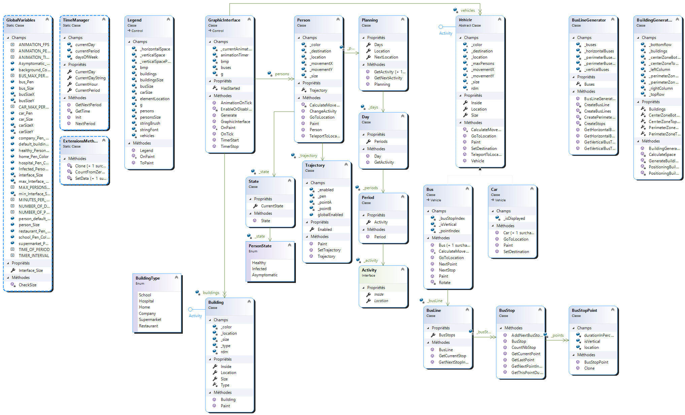
  - Planning effectif
  - Bilan personnel
    - Compétences techniques
    - Apport au travail de diplôme
  - Conclusion
  - Synthèse des activités
    - Résumé logBook
    - Activités
  - Correction de l'orthographe
- Changement de la taille des éléments en fonction de la taille de la forme.
  - Les batiments changent de taille en fonction de la taille de la form
  - Bug concernant la hauteur. Ne fonctionne pas correctement si la taille est insuffisante.
    - La taille semble être correcte en donnée mais pas à l'affichage.

# 15.04.2021
- Essai de régler le bug de taille
  - Problème détecté dans l'arrondi.
  - Problème réglé en ajoutant la taille des bus dans le calcul
- Modification de la légende et de l'horloge
- Suppression de la classe Clock pour un label
  - Simplifie le resize du control
- Extraction de la légende du control "Graphic interface" à une form extern.
  - Léger problème de nommage causant un bug entre FrmLegend.cs et Legend.cs. Réglé en recréant la form et la classe et en nommant FrmLegend dès le départ.
- Intégration des graphiques