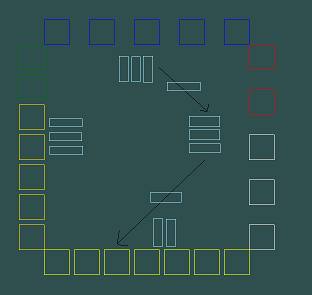
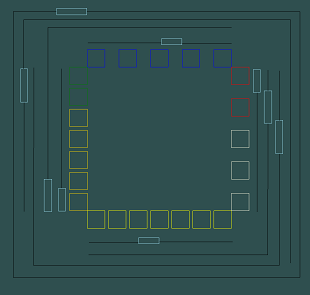
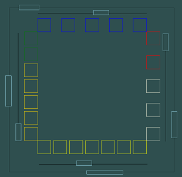
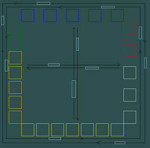
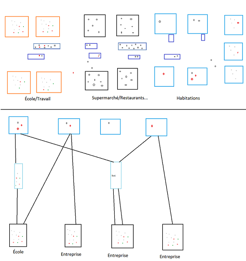
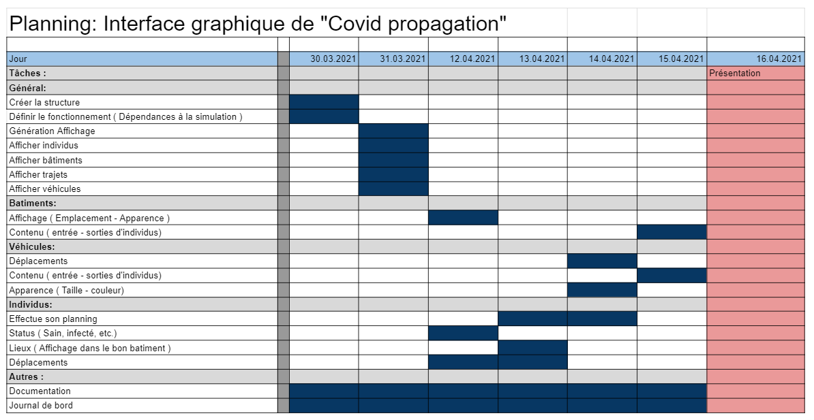
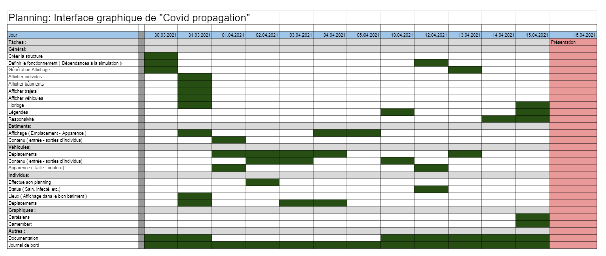

# 1. `Table des matières`
- [1. `Table des matières`](#1-table-des-matières)
- [2. `Introduction`](#2-introduction)
- [3. `Problèmes rencontrés`](#3-problèmes-rencontrés)
  - [3.1. `Structure`](#31-structure)
  - [3.2. `Timer`](#32-timer)
  - [3.3. `Création de fausses données`](#33-création-de-fausses-données)
  - [3.4. `Bus`](#34-bus)
- [4. `Cahier des charges`](#4-cahier-des-charges)
  - [4.1. `Titre`](#41-titre)
  - [4.2. `Fonctionnalités`](#42-fonctionnalités)
    - [4.2.1. `Améliorations`](#421-améliorations)
  - [4.3. `Matériel et logiciels`](#43-matériel-et-logiciels)
  - [4.4. `Prérequis`](#44-prérequis)
  - [4.5. `Enseignant`](#45-enseignant)
  - [4.6. `Descriptif du projet`](#46-descriptif-du-projet)
- [5. `Environnement`](#5-environnement)
- [6. `Architecture`](#6-architecture)
  - [6.1. `Arborescence`](#61-arborescence)
  - [6.2. `Structure`](#62-structure)
  - [6.3. `Implémentation dans le travail de diplôme`](#63-implémentation-dans-le-travail-de-diplôme)
- [7. `Description des Activités`](#7-description-des-activités)
  - [7.1. `Description journal de bord`](#71-description-journal-de-bord)
  - [7.2. `Activités`](#72-activités)
    - [7.2.1. `Création et réflexion de la structure du projet`](#721-création-et-réflexion-de-la-structure-du-projet)
    - [7.2.2. `Création des individus et planning`](#722-création-des-individus-et-planning)
    - [7.2.3. `Création des batiments`](#723-création-des-batiments)
    - [7.2.4. `Véhicules`](#724-véhicules)
      - [7.2.4.1. `Création des Voiture`](#7241-création-des-voiture)
      - [7.2.4.2. `Création des Bus`](#7242-création-des-bus)
    - [7.2.6. `Correction timers et déplacements`](#726-correction-timers-et-déplacements)
    - [7.2.7. `Création légende`](#727-création-légende)
    - [7.2.8. `Méthodes d'extensions`](#728-méthodes-dextensions)
- [8. `Planning`](#8-planning)
  - [8.1. `Prévisionnel`](#81-prévisionnel)
  - [8.2. `Effectif`](#82-effectif)
- [9. `Bilan personnel`](#9-bilan-personnel)
  - [9.1. `Compétences techniques`](#91-compétences-techniques)
  - [9.2. `Apport au travail de diplôme`](#92-apport-au-travail-de-diplôme)
- [10. `Conclusion`](#10-conclusion)
- [11. `Table des figures`](#11-table-des-figures)
- [12. `Annexes`](#12-annexes)
- [13. `Livrables`](#13-livrables)
# 2. `Introduction`
Ce projet de stage consiste à la réalisation de l'interface graphique du travail de diplôme "Covid propagation". Il s'agit donc de la partie graphique qui permet la visualisation des individus, leurs déplacements, leur lieux de travail, etc. Elle permet d'aquérir une vision plus "logique" de la simulation en dehors des graphiques. Les individus saint, infecté et immunisé sont différencié par leurs couleurs. La même technique est utilisée pour différencier les différents batiments et véhicules mais avec d'autres code couleurs. Les véhicules sont aussi différencié par leur taille en plus de leur couleur.

Ce travail est très important pour le travail de diplôme car il en fait parti mais surtout car il permet de facilement se rendre compte si la simulation se déroule correctement ou si il y a un ou plusieurs bug. Il permet donc d'améliorer mon rendement et de rendre le développement plus rapide et efficace.

Pour réaliser se travail, il faudra que je simule des données d'individus. Pour fonctionner, l'interface à besoin de données mais ces données n'étant pas encore créées, je vais devoir en générer des fausses qui seront par la suite supprimées.

Ce travail a pour but de remplacer les stages de techniciens qui devaient avoir lieu en première année (2019-2020) mais qui ont été annulé dut à la pandémie. Il doit contenir un rapport similaire et doit représenter une charge de travail correspondant au stage. Il dure du mardi 06 avril au jeudi 15 avril, 6 jours sans compter les vacances, en comptant 8 heures de travail par jour soit 48 heures de travail au total.

# 3. `Problèmes rencontrés`
## 3.1. `Structure`
La structure du code est comme prévu l'une des plus grosse difficulté du projet. En plus de demander beaucoup de réflexion, elle ne cesse de changer pour accuellir de nouvelles idées ou fonctionnalités. Ces modifications qui sont au départ la normalité, deviennent plus compliquée au fur et à mesure que le projet avance. Il ne s'agit pas d'un problème majeur et il fait entièrement partie de ce type de projet. Il ralentit le développement mais aucun blocage majeur ne s'est produit.

## 3.2. `Timer`
L'emplacement du timer ou simplement leur utilité dans le code a apporté quelques problèmes au début du projet. Le changement d'activité ainsi que les animation se faisaient sur le même timer ce qui faisait que les individus se déplaçaient extremement vite alors que le bute principal du timer d'animation est de gérer les animations et non les changements d'activités. Une fois le changement effectué, tout c'est bien passé.

## 3.3. `Création de fausses données`
La création de ces données est nécessaire pour avoir quelque chose à afficher. Elle est très rustre car justement destinée à être supprimer dans le futur. Elle peut poser des problèmes en terme de création des planning. Une erreur d'assignation ou de valeur peut rapidement donner des résultats étonnants. Il reste malgré tout très simple et rapide de modifier le code pour palier à ces problèmes.

## 3.4. `Bus`
Sans compter le code qui est l'une des partie les plus complexe du projet, créer une structure viable en terme de planning des individus et de lisibilité est un énorme challenge. J'y ai beaucoup réflechis et suis passé par de nombreux plan avant de trouver une méthode qui me semble réellement viable.

La première étant de créer des arrêts de bus pour chaque ligne de batiments. Ces arrêts se trouvant au centre, ça signifie que la totalité des déplacements s'effectuent au centre. En plus de cela, Il aurait fallut qu'ils soient capables de se déplacer en direction de chaque ligne / colonne et donc créer énormément de traffique.



<p style="font-size: 11px">Figure 1: Idée de fonctionnement des bus 1</p>

La deuxième idée qui commence à se raprocher du résultat final est la suivante. Créer des lignes de bus qui se situent à l'exterieur pour éviter le traffique et garder un maximum de lisibilité. Cependant, rien qu'en regardant la maquette, on se rend compte de la complexité et de la difficulté à savoir quel bus se dirige vers quel endroit.



<p style="font-size: 11px">Figure 2: Idée de fonctionnement des bus 2</p>

Cette troisième idée est la pour palier à ce problème en simplifiant grandement la deuxième idée tout en gardant un traffic exterieur aux batiments. Une ligne de bus par ligne / colonne de bâtiments ainsi qu'une ligne traversant la totalité des batiments pour tous les relier.



<p style="font-size: 11px">Figure 3: Idée de fonctionnement des bus 3</p>

Pour finir, J'en suis arrivé à la conclusion qu'un mixe entre interne et externe semble être le plus efficace. Avec cette structure, un individus peut se rendre n'importe ou en une seule période. Les bus au centre ajoutent du traffique mais rien de trop chargé comparé aux autres idée. C'est donc l'idée qui a été implémentée dans le projet.



<p style="font-size: 11px">Figure 4: Idée de fonctionnement des bus 4 et final<p>

# 4. `Cahier des charges`
## 4.1. `Titre`
Covid propagation
## 4.2. `Fonctionnalités`
- Bâtiments
    - Affichage des individus
    - Type
- Individus
  - Déplacements
    - Maison
    - Lieu de travail
    - Supermarché
    - ...
  - Status
  - Moyen de transport
- Véhicules
  - Affichage des individus
  - Type
  - Déplacements
### 4.2.1. `Améliorations`
- Individus cliquable
  - Mise en évidence de l'individus
  - Affichage de ses informations

## 4.3. `Matériel et logiciels`
- Pc techniciens
- Visual studio 2019
- Une connexion internet
- Github

## 4.4. `Prérequis`
- C#
- Visual studio 2019
- Élements Graphiques c#

## 4.5. `Enseignant`
- Mr. Mathieu Michaël 

## 4.6. `Descriptif du projet`
L'interface graphique affiche les individus ainsi que leur lieur de travail, habitation et déplacements. Elle permet d'avoir une visualisation plus naturelle de la situation. La structure est simple pour éviter des complexification liée aux routes et autres éléments qui ne sont pas important pour ce travail. Il s'agit donc d'une aide visuel de la simulation. Il n'y a donc pas de routes ou autres éléments complexe similaires.
Voici deux exemples d'interface graphique :


<center style="font-size: 11px">Figure 5: Maquette du projet</center>

# 5. `Environnement`
L'environnement de travail est composé d'un pc technicien, 3 écrans, clavier, souris et d'un ssd amovible avec windows 10 pro version 10.0.19042 Build 19042. Le code est réalisé à l'aide de visual studio 2019 version 16.9.2. La documentation et le logbook sont réalisé à l'aide de visual studio code et des extensions Markdown All in One et Mardown PDF.
# 6. `Architecture`
## 6.1. `Arborescence`
```
├── CovidPropagationGraphicInterface
│   ├── .vs
│   ├── CovidPropagationGraphicInterface
│   └── CovidPropagationGraphicInterface.sln
└── Documentation
    ├── Documentation.md
    ├── LogBook.md
    └── Medias
        ├── ClassDiagram1.png
        ├── ExemplesInterfaceGraphique.png
        ├── PlanningPrevisionnel.png
        ├── StructureProjet.png
        ├── UseCase.png
        └── UseCase2.png
```
## 6.2. `Structure`
La classe GraphicInterface s'occupe de gérer tous les objets graphics (Position, Temps, etc.). La classe Person est une version différente de celle se trouvant dans la simulation. Outre son status, elle ne compte que des éléments graphiques. Le même cas s'applique aux batiments, et vehicules qui sont une reproduction graphique de leur équivalents dans la simulation.

Seul la trajectoire est unique à cette section du projet car il s'agit d'un élément purement graphique. Elle est là uniquement pour aider à visualiser les trajectoires des individus.

<center style="font-size: 11px">Figure 6: Diagramme de classe</center>

## 6.3. `Implémentation dans le travail de diplôme`
Le résultat de ce travail étant la partie graphique de mon travail de diplôme, j'ai du pensé à une manière simple et efficace de l'implémenté à l'intérieur. J'ai pensé à différentes approches.

La première étant le fait de simplement intégré la simulation à l'interface graphique. Cette approche permettrait de n'avoir qu'un seul objet de chaque type. C'est l'approche la plus simple mais elle me pose problème en tant qu'ergonomie du code ainsi que de la séparation des données de la vue.

En deuxième, j'ai pensé à une interface qui serait controllée par la simulation mais qui ne serait pas directement intégré dans le objets de celle-ci. Il s'agit d'un hybride entre les deux autres méthodes. Je penses cependant, qu'il s'agisse d'une méthode qui ne soit pas viable.

Et pour terminer celle que j'ai choisis, il s'agit de séparer l'interface graphique de la simulation. Pour ce faire, il faut malheureusement une structure similaire à la simulation ce qui peut finir par réduire drastiquement les performances du projet. Cependant, la structure du code n'en sera que plus propre et le fait que les deux soient autonome évitera de les problèmes de modification de la simulation impactant l'interface graphique.

# 7. `Description des Activités`
## 7.1. `Description journal de bord`
Pendant la durée du stage, j'ai inscrit toutes mes activités dans le journal de bord ainsi que mes reflections majeurs sur les fonctionnalités du projet. Il est organisé par date ainsi que dans l'ordre chronologique des évènements de la journée.
## 7.2. `Activités`
### 7.2.1. `Création et réflexion de la structure du projet`
Ce projet étant étroitement lié à la simulation de mon travail de diplôme, il fallait réfléchir à une structure permettant la communication de certain éléments entre les deux structures.

En gardant cette idée en tête, j'ai fait des maquettes illustrant différentes situations pour ensuite créer un structure de classe initiale qui servant de base à la programmation.

C'est ensuite au fur et à mesure que le projet avançait que j'ai implémenté des fonctionnalités permettant la communication entre les deux structures tel que le status d'un individus qui s'il change, doit être instentanément retranscrit dans l'interface graphique. Pour la majorité des autres éléments, il ne s'agit qu'au démarrage de l'application que ces données sont inscritent.

### 7.2.2. `Création des individus et planning`
J'ai commencé par pensé à différentes structure du planning et ait finit par choisir une version simple composé de jours de la semaine ainsi que de périodes de 30 min dans ces jours. Le planning comporte donc 7 jours et 48 période par jour. Pour gérer le planning de tous les individus, j'ai créé une classe qui s'occupe de gérer le temps actuel ainsi que le temps qui passe.

Après cela, j'ai implémenté les individus qui suivent le planning qui leur est attribué en se rendant au lieu indiqué sur chaque activité. Une fois qu'ils suivaient correctement le planning, j'ai ajouté les déplacement physique plutôt que la téléportation à la base.

### 7.2.3. `Création des batiments`
J'ai d'abord créé les batiments dans le simple but de vérifier que les individus se déplacent correctement et aux bons endroits. C'est après cette étape que j'ai modifier ceux-ci pour qu'ils s'affichent toujours correctement peut importe leurs taille et nombre.

### 7.2.4. `Véhicules`
#### 7.2.4.1. `Création des Voiture`
Les voitures sont des objets appartenant à des individus et étant lié à ceux-ci grâce à leur planning. Lorsqu'un individu a besoin de se déplacer en voiture, celle-ci s'affiche et enregistre la destination. L'individus entre dans la voiture puis celle-ci se dirige vers la destination avant de se désafficher pour éviter le surplus d'éléments.

#### 7.2.4.2. `Création des Bus`
Les bus étant beaucoup plus complexe et indépendant que le voitures, il est important de passer un certain temps à réfléchir à leur structure, façon de fonctionner et apparence. J'ai créé plusieurs maquettes et eu différentes idées avant d'en trouver une convenable et de passer à la création des bus.

Les bus, contrairement au voiture, sont indépendant. Lors de leur création, un itinéraire leur est attribué. Cet itinéraire définit le trajet ainsi que la position de départ du bus. Ils se déplacent de manière linéaire et sans jamais prendre de pause.

Leur itinéraires sont composé d'arrêt qui permettent aux bus d'avoir des vitesse qui varient en fonction de s'il sont sur une voie normal ou à un arrêt.

### 7.2.6. `Correction timers et déplacements`
Il existe deux timer dans le projet, un s'occupe de l'écoulement du temps et donc des changements d'activités des plannings et l'autre s'occupe d'afficher les éléments graphique. Le timer qui s'occupe de l'affichage doit s'écouler 60 fois par seconde indépendamment du planning. Pour qu'il soit autonome, il a fallut effectuer un certain nombre de calcul pour garder 60 images par seconde en ignorant la durée d'une période.

Les déplacements étaient aussi impacté par ce problème car ils se déplaçaient soit trop loins soit pas assez loins.

### 7.2.7. `Création légende`
Pour simplifier la compréhension d'un utilisateur, j'ai ajouté une légende comprenant une image de tous les éléments de l'interface ainsi que leur nom à côté.

### 7.2.8. `Méthodes d'extensions`
Pour simplifier mon travail et surtout pour simplifier le code, j'ai ajouté des méthodes d'extensions qui permettent de modifier des éléments déjà existant et d'y ajouter une action. Action qui dans mon cas permet d'écrire en une ligne ce qui en demenderait plusieurs ou simplement de rendre la lecture du code plus agréable.

# 8. `Planning`
Le planning n'est pas nécessaire pour ce projet cependant, je m'en suis créé un dans le but de m'aider à visualiser le travail à effectuer ainsi qu'à définir par quoi je devrais commencer.

## 8.1. `Prévisionnel`
J'ai prévu de d'abord commencé par codé la base de chaque objets et donc de les afficher. Une fois qu'ils sont tous affiché, je prévois de commencer à effectuer les déplacement ainsi que le status des individus. Seulement une fois qu'ils sont capables de se déplacer, j'implémenterai les véhicules. Si tout se passe bien, il me restera du temps le dernier jour pour tout peaufiner.

<center style="font-size: 11px">Figure 7: Planning prévisionnel du projet</center>

## 8.2. `Effectif`
La prévision faite pour le début du projet était correcte à l'exception que je suis allé plus vite que prévu dans certaine tâche. En plus de cela, j'ai travaillé durant le vacances ce qui n'était pas prévu dans le planning. La suite est beaucoup moins structuré que dans les prévisions mais ça me semble parfaitement normal. C'est uniquement du au fait qu'en codant un certaine section il est possible de voir des problèmes qui se situent dans d'autre section m'obligeant à faire des modifications. Le projet a tout de même pu atteindre un niveau suffisant d'après moi.


<center style="font-size: 11px">Figure 8: Planning effectif du projet</center>

# 9. `Bilan personnel`
## 9.1. `Compétences techniques`
Lors du CFC ainsi que de la première année de technicien, nous avons appris énormément de techniques, pattern et autres. Durant la deuxième année technicien nous n'avons eu que peu de temps en classe pour prendre se remémorer ces différentes techniques ou en apprendre de nouvelles. Ce travail m'a donc énormément aidé dans le fait de récupérer un niveau qui me convient pour le travail de diplôme qui s'annonce.

En plus d'appliquer les nombreuses techniques apprisent lors de mon apprentissage comme l'héritage, j'ai pu en apprendre de nouvelles comme par exemple les méthodes d'extensions qui est en soit très simple d'application mais très utile. Comme il permet de modifier des éléments déjà existant comme des listes pour y ajouter une méthode à nous, ça m'a permit de gagner en temps et en lisibilité.

Ayant comme tendance à foncer tête dans le guidons par manque de temps lorsque nous devons réaliser un projet, ce projet m'a aussi permis de prendre le temps de réfléchir à la structure de mon code ainsi qu'à son fonctionnement. Ce changement, m'a permis de réaliser un code dont je suis fiere.

## 9.2. `Apport au travail de diplôme`
Ce travail m'aidera énormément pour le travail de diplôme dans le sens où je pourrais visualiser les données qui seront traitées. Je n'aurais pas quelque lignes de commande comme unique aide au débogage. Cet interface graphique permettra donc de visualiser ce qu'il se passe dans la simulation et me servira aussi lors du développement de la simulation.

# 10. `Conclusion`
Ce stage m'a permi de me remmetre dans le bain et de reprendre en main le C# tout en apprenant l'importance de prendre son temps. J'ai pu travaillé comme prévu et même plus encore. À l'excpetion d'une matinée passé à trouver et régler un bug, je n'ai eu aucun problème de concentration et ai pu travailler du début à la fin sans soucis. Ce projet sera forcement utile à la réalisation de mon travail de diplome et me rassure sur sa structure et complexité qui me semble élevé mais réalisable.

# 11. `Table des figures`
- [Idée Bus 1](#34-Bus)
- [Idée Bus 2](#34-Bus)
- [Idée Bus 3](#34-Bus)
- [Idée Bus 4 et finale](#34-Bus)
- [Maquette du projet](#46-descriptif-du-projet)
- [Structure du code](#62-structure)
- [Planning prévisionnel](#81-Prévisionnel)
- [Planning effectif](#82-Effectif)

# 12. `Annexes`
- Projet C#
- Images
  - Diagramme de classe
  - Planning prévisionnel
  - Planning effectif
- Journal de bord

# 13. `Livrables`
- Documentation
- Logbook
- Programme C# Interface graphique